<div align="center">

# 🌑 Moon Soil Mineral Mapping — Hyperspectral

### Identification and mapping of lunar maria minerals from **Chandrayaan‑1 M³** and **Chandrayaan‑2 IIRS** hyperspectral data

*A complete, scientifically-traceable pipeline: raw radiance → reflectance → selenoreferenced cubes → band parameters → mineral maps → cross-sensor comparison.*

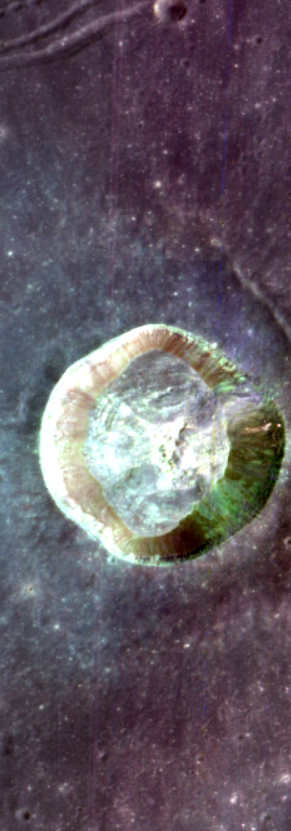

<sub>**Dawes crater**, Mare Tranquillitatis — Chandrayaan‑2 IIRS false-colour composite, after the full pre-processing chain.</sub>

<br>


</div>

---

## Table of contents

- [Overview](#overview)
- [Study area](#study-area)
- [Data used](#data-used)
- [Methodology](#methodology)
- [Results](#results)
  - [1 · Pre-processing](#1--pre-processing)
  - [2 · Subset & false-colour composite](#2--subset--false-colour-composite)
  - [3 · Spectral similarity analysis](#3--spectral-similarity-analysis)
  - [4 · Band-parameter maps](#4--band-parameter-maps)
  - [5 · Mineral classification — SAM / SFF / SVM](#5--mineral-classification--sam--sff--svm)
  - [6 · Cross-sensor comparison](#6--cross-sensor-comparison)
- [Key findings](#key-findings)
- [Repository layout](#repository-layout)
- [Getting started](#getting-started)
- [Validation](#validation)
- [Caveats & limitations](#caveats--limitations)
- [References](#references)

---

## Overview

Hyperspectral remote sensing lets us identify minerals from orbit: every mineral absorbs
infrared light in its own way, leaving a **spectral fingerprint** in the reflected sunlight.

Lunar mineral mapping has historically relied on **Chandrayaan‑1's Moon Mineralogy Mapper (M³)**.
This project asks whether **Chandrayaan‑2's Imaging Infrared Spectrometer (IIRS)** — with finer
spatial and spectral sampling — can do the same job, and how the two sensors compare when both
are processed through an identical, scientifically-defensible chain over the *same ground points*.

**Objective** — identify and map minerals in the lunar maria using Chandrayaan‑2 IIRS
hyperspectral data via spectral-feature and band-parameter techniques, and perform a
**comparative analysis** against Chandrayaan‑1 M³.

**Sub-objectives**

1. Mineral identification and mapping from CH‑2 IIRS using **band parameters**, **SAM**, **SFF** and **SVM**.
2. **Comparative analysis** of lunar mineral mapping between CH‑1 M³ and CH‑2 IIRS.

Six mineral endmembers are targeted, all drawn from the **RELAB** spectral library:
`olivine` · `clinopyroxene` · `orthopyroxene` · `plagioclase` · `ilmenite` · `Mg-spinel`.

---

## Study area

**Mare Tranquillitatis** — a large basaltic plain on the lunar near side, formed by ancient
volcanic lava flows and rich in mafic minerals.

**Dawes crater** sits inside the selected IIRS strip: a fresh impact crater with a distinct
rim and floor morphology, exposing unweathered material against a mature regolith background.
That contrast is exactly what makes it a good mineralogical test target.

| Chandrayaan‑1 M³ | Chandrayaan‑2 IIRS |
|:--:|:--:|
| 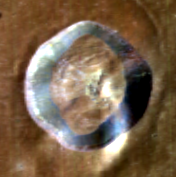 | 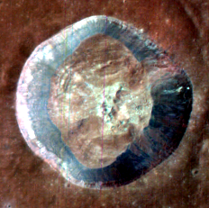 |
| R ≈ 2 µm · G ≈ 1 µm · B = continuum | same mafic FCC, IIRS bands |

---

## Data used

| Parameter | Chandrayaan‑2 (IIRS) | Chandrayaan‑1 (M³) |
|---|---|---|
| Satellite | Chandrayaan‑2 | Chandrayaan‑1 |
| Sensor | IIRS — Imaging Infrared Spectrometer | M³ — Moon Mineralogy Mapper |
| Dataset ID | `CH2_IIR_NRI_20250804T0253259678_D_IMG_D18` | `M3G20090731T045352_V01_RFL` |
| Acquisition | 04 Aug 2025, 02:53:25 UTC | 31 Jul 2009, 04:53:52 UTC |
| Processing level (as used) | L1 radiance | L2 reflectance |
| Raw cube | 250 × 13 569 × 256, BSQ uint16 | 304 × 29 939 × 85, BIL float32 |
| Spectral range | 800 – 5000 nm | 405 – 3000 nm |
| Spectral bands | 256 (247 after trim) | 85 |
| Spectral resolution | 20 – 25 nm | 30 nm |
| Spatial resolution | ~80 m (gridded at 94.56 m) | 140 m |
| Swath | 20 km | 40 km |

All georeferenced products share one CRS: **Equirectangular, Moon 2000**, sphere R = 1737.4 km.

---

## Methodology

```
                CH-2 IIRS (L1 radiance)                 CH-1 M³ (L2 reflectance)
                          │                                        │
   1  Radiometric calibration  (DN × 0.01)                         │
                          │                                        │
   2  Thermal removal → I/F reflectance  (Planck, ε=0.95)          │
                          │                                        │
   3  Photometric correction  (Lommel-Seeliger → i=30°,e=0°,g=30°) │
                          │                                        │
   4  Selenoreferencing  (PDS4 corner GCPs → Moon2000 eqc)    Selenoreferencing
                          │                                   (GCP grid + TPS warp)
   5  Destriping  (per-detector moment matching, sensor domain)    │
                          │                                        │
                          └──────────────┬─────────────────────────┘
                                         │
                    ROI subset (Dawes crater)  ← MANUAL, cut in ENVI
                                         │
        ┌────────────────┬───────────────┼────────────────┬──────────────────┐
        │                │               │                │                  │
   Mafic FCC     Band parameters   Spectral profiles   SAM / SFF / SVM   Crater zone
                  (BR·BT·BS·BC)     (vs RELAB)          classification     transect
        │                │               │                │                  │
        └────────────────┴───────────────┴────────────────┴──────────────────┘
                                         │
                              Comparative analysis (M³ ↔ IIRS)
```

The CH‑2 chain reproduces the ISRO reference **CH2IIRS** QGIS plugin
(Verma, Chauhan & Chauhan 2022, *Icarus* **383**, 115075) — including its 247-band empirical
spectral correction and band trim — so that its outputs can be cross-checked against the
ISRO-produced reference products shipped with the data.

**Every step is written out as both ENVI (`.img` + `.hdr`, with wavelengths and `map info`)
and GeoTIFF, all bands.**

<details>
<summary><b>Step details (click to expand)</b></summary>

**1 · Radiometric calibration.** `radiance = DN × 0.01` mW·cm⁻²·sr⁻¹·µm⁻¹ (CH2IIRS convention), 256 bands.

**Aux · Incidence angle.** From the `.spm` housekeeping file, `i = 90° − sun_elevation`, per line.

**2 · Thermal removal → reflectance.** Brightness temperature by inverting Planck over
4500–4874 nm with ε = 0.95; the thermal component `B(λ,T)` is subtracted and the result
converted to I/F: `ref = π·(L − ε·B) / E_sun(λ)`, then divided by the 247-band empirical
spectral correction and 3-point smoothed. Bands 1–7 and 255–256 dropped → **247 bands, 847–4993 nm**.

**3 · Photometric correction.** Lommel-Seeliger disk function `D(i,e) = cos i / (cos i + cos e)`,
nadir emission, normalised to standard geometry `i=30°, e=0°, g=30°`.

**4 · Selenoreferencing.** CH‑2: four PDS4 corner GCPs → Moon 2000 equirectangular, 94.56 m/px.
CH‑1: a dense GCP grid read from the LOC backplane, warped with **thin-plate splines** (TPS),
140 m/px. *(A `gdalwarp -geoloc` attempt collapsed longitude and was discarded.)*

**5 · Destriping.** Per-detector (per cross-track column) moment matching, performed in
**sensor geometry** — the only domain where the stripes are column-aligned — then georeferenced.

**Analysis.** Both cubes are subset to the same Dawes-crater ROI, and every sample point is
selected **once** on M³, converted to lon/lat, then read back at the *identical ground
coordinate* in each sensor (verified Δlon = Δlat = 0). This makes the comparison genuinely
point-for-point rather than pixel-for-pixel.

</details>

---

## Results

### 1 · Pre-processing

Dawes crater in the raw IIRS strip, and after the full chain. The vertical lines are
detector stripe-noise; destriping removes them without touching the spectral shape.

<div align="center">
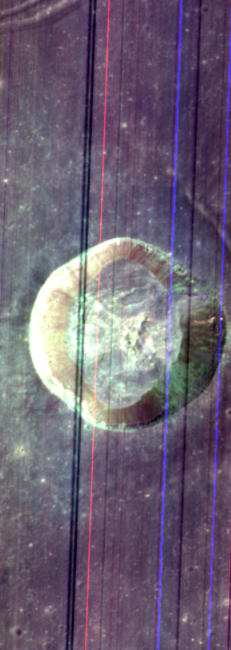
&nbsp;&nbsp;&nbsp;→&nbsp;&nbsp;&nbsp;


<sub>Left: photometrically corrected, striped. Right: after per-detector destriping.</sub>
</div>

### 2 · Subset & false-colour composite

A spatial crop to the crater plus a spectral trim to the range shared by both sensors
(≤ 2600 nm, the RELAB library limit) keeps the analysis focused and comparable.
The **mafic FCC** (R ≈ 2 µm, G ≈ 1 µm, B = continuum) makes iron-bearing minerals pop:
fresh crater material appears bright, mature mare soil dark.

> ### ✋ The subset is a manual step — there is no script for it
>
> The ROI subsets were cut **by hand in ENVI** (ROI → *Subset Data from ROIs*) from the
> final selenoreferenced cubes, and saved as ENVI binary + `.hdr` pairs:
>
> ```
> pipeline/outputs/Subset/ch1_subset/ch1_subset  + .hdr    176 × 177 × 85   @ 140 m
> pipeline/outputs/Subset/ch2_subset/ch2_subset  + .hdr    232 × 231 × 247  @ 94.56 m
> ```
>
> Both must be **Equirectangular Moon 2000** and cover the same ground area — every
> analysis script downstream reads these two files directly and co-locates points between
> them by longitude/latitude. Cut your own subset before running any of the analysis steps;
> the paths above are exactly what `mineral_common.py` expects. Note the binaries are
> *extensionless* (`ch1_subset`, not `ch1_subset.img`), each inside its own folder —
> ENVI's default output layout.

### 3 · Spectral similarity analysis

Reflectance sampled at diagnostic points, plotted against RELAB laboratory spectra.
The dips near **1000 nm** and **2000 nm** are the crystal-field absorptions of iron-bearing
pyroxene and olivine — the features every method below keys on.

> **Note on point selection.** Sample points are chosen from *library-independent* diagnostic
> band depths computed from the cube itself, never by matching against RELAB. Using the library
> to pick the points and then to validate them would be circular. RELAB is used only for the
> plotted shape overlay.

| M³ spectral profile | IIRS spectral profile |
|:--:|:--:|
| 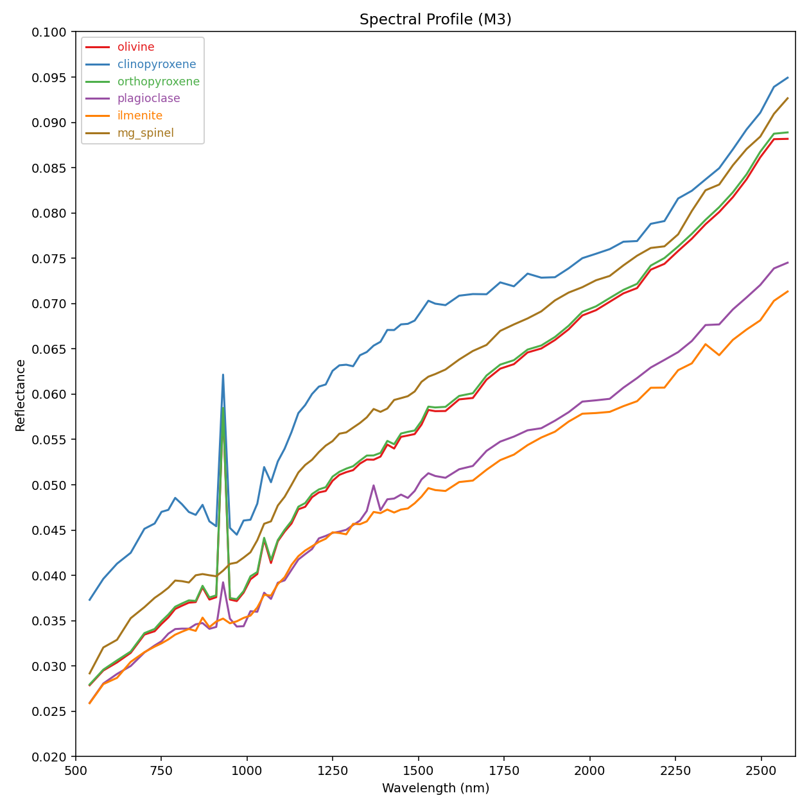 | 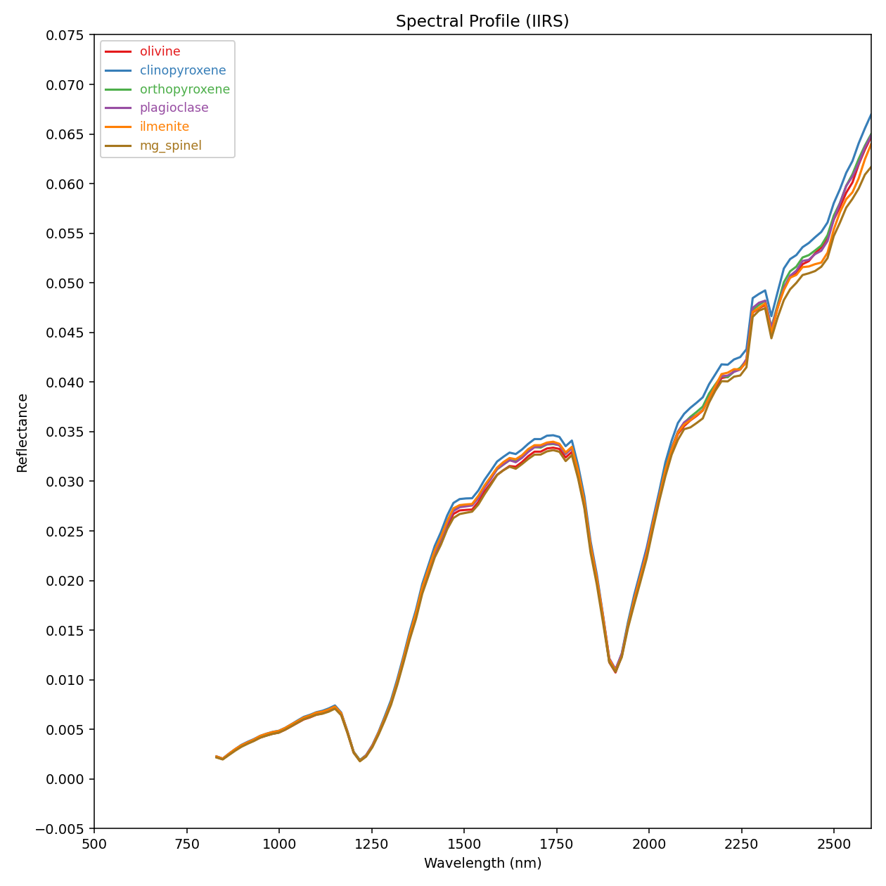 |

M³ spectra are clean, with unambiguous 1 µm and 2 µm bands. IIRS is noisier, and its deep
dip near ~1900 nm is **not** a mineral band — see [Key findings](#key-findings).

**Crater geomorphic zones.** Six zones — centre, interior, inner edge, rim, outer edge,
outside wall — at 0 / 0.45 / 0.75 / 1.0 / 1.25 / 1.6 × R, each placed on a different azimuth
and each sampled at the same ground point in both sensors.

| Sampling points on the FCC (M³) | Zone spectra (M³) |
|:--:|:--:|
| 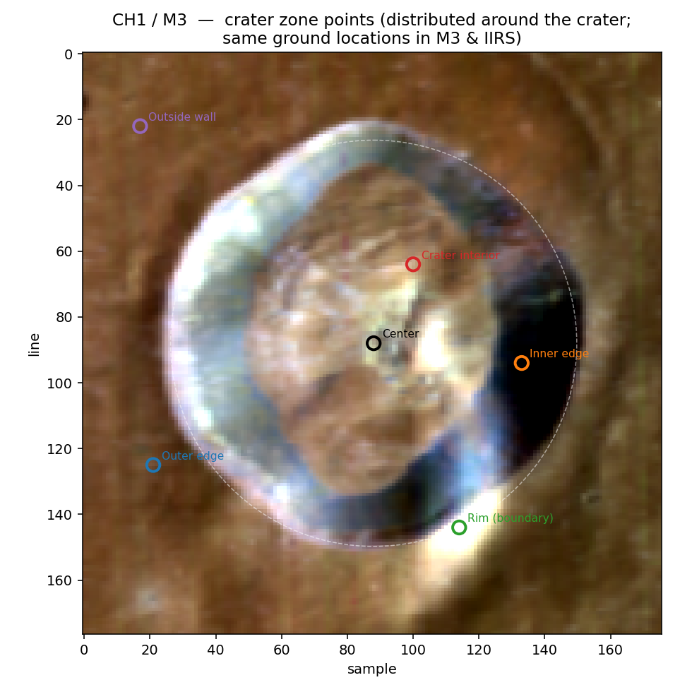 | 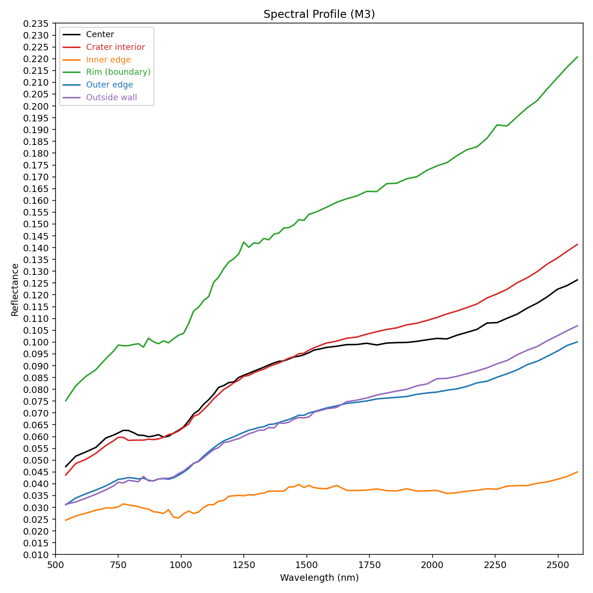 |

### 4 · Band-parameter maps

The **Band Shaping Algorithm** turns subtle spectral dips into images by taking reflectance
ratios at fixed wavelengths:

| Parameter | Meaning | M³ | IIRS |
|---|---|---|---|
| **BR** — Band Ratio | 2 µm vs 1 µm strength | B₂₀₁₈ / B₁₀₀₉ | B₂₀₂₆ / B₁₀₁₅ |
| **BT** — Band Tilt | asymmetry of the 1 µm band | B₉₁₀ / B₁₀₀₉ | B₉₁₄ / B₁₀₁₅ |
| **BS** — Band Strength | depth of the 1 µm band | B₁₀₀₉ / B₇₅₀ | B₁₀₁₅ / B₈₄₇ |
| **BC** — Band Curvature | shape around the 1 µm band | B₇₅₀/B₉₁₀ + B₁₀₀₉/B₉₁₀ | B₈₄₇/B₉₁₄ + B₁₀₁₅/B₉₁₄ |

| M³ (BR · BT · BS · BC) | IIRS (BR · BT · BS · BC) |
|:--:|:--:|
| 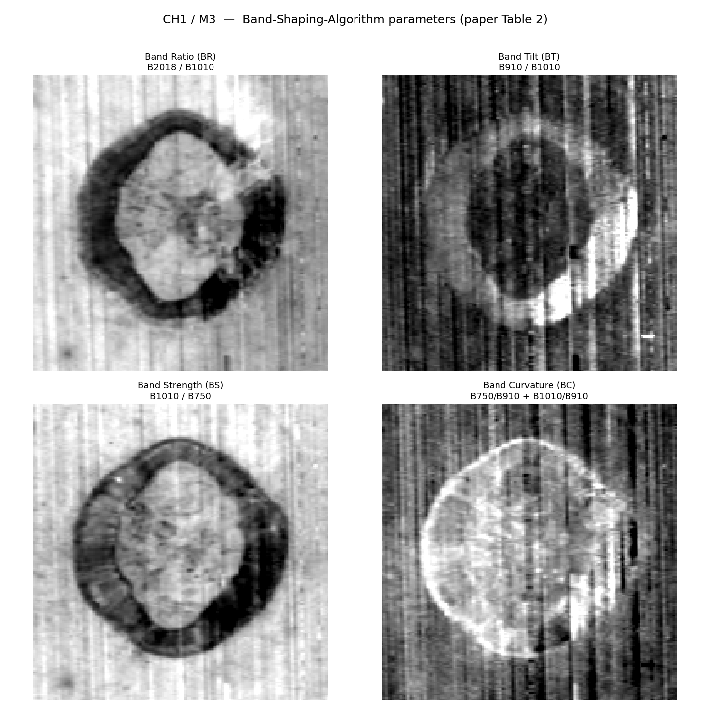 | 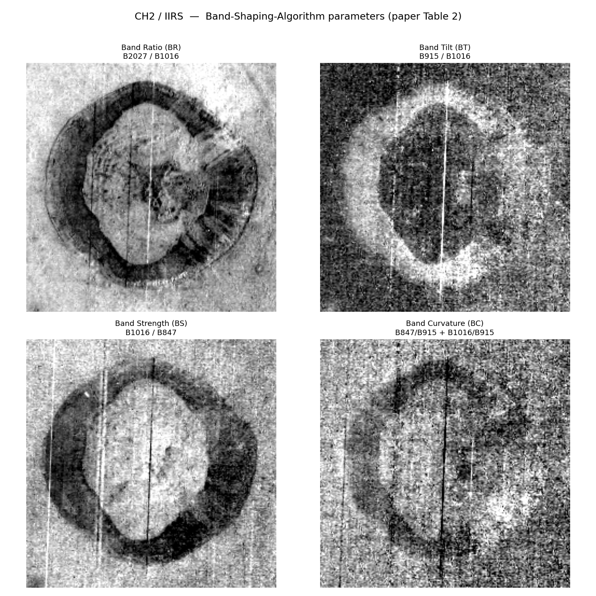 |

The crater rim stands out as a low-BR ring in both sensors — mafic-rich, freshly exposed.
The IIRS maps are visibly noisier, a direct consequence of its weaker signal.

An enhanced composite (R = BR, G = BT, B = BS) summarises all three in one image:

| 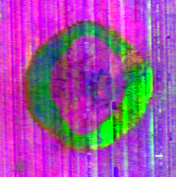 | 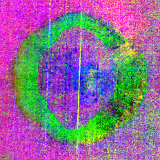 |
|:--:|:--:|
| M³ BSA composite | IIRS BSA composite |

### 5 · Mineral classification — SAM / SFF / SVM

Three standard classifiers, all fed the same **two-band continuum-removed** feature vector
(the 1 µm and 2 µm absorptions each continuum-removed against their own local straight-line
continuum, then concatenated). A single full-range hull was found to be degenerate — it
collapsed every pixel into one class. Pixels whose diagnostic band is shallower than 2 % are
left **Unclassified** rather than forced into a mineral.

| Method | How it decides |
|---|---|
| **SAM** — Spectral Angle Mapper | smallest angle between pixel and library vector; ignores brightness |
| **SFF** — Spectral Feature Fitting | least-squares fit of absorption **depth and shape**; best fit wins |
| **SVM** — Support Vector Machine | RBF classifier trained on library endmembers augmented with gain + noise |

#### Chandrayaan‑1 M³

<div align="center">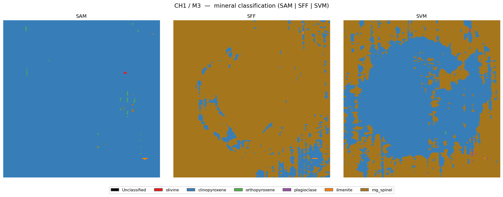</div>

| Method | Result |
|---|---|
| **SAM** | 99.7 % clinopyroxene — winner-take-all: cpx is globally the nearest endmember |
| **SFF** | 92.4 % Mg-spinel-like background, 7.6 % clinopyroxene tracing the **crater ring** |
| **SVM** | 54.3 % clinopyroxene / 45.6 % Mg-spinel-like — cleanly separates crater interior from mature soil |

SFF and SVM both resolve the crater; SAM's winner-take-all behaviour does not. All three
agree the scene is **pyroxene-dominated basalt**, exactly as expected in a mare.

#### Chandrayaan‑2 IIRS

<div align="center">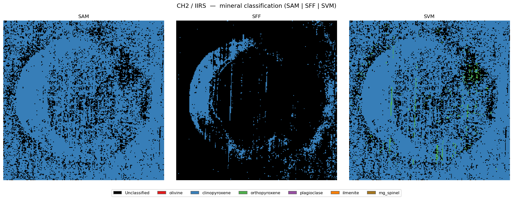</div>

IIRS is classified on the **2 µm band alone**, over the reliable window **2010 – 2560 nm**
(see [Key findings](#key-findings) for why). Only clinopyroxene and orthopyroxene have a
diagnostic band in that window, so only those two are assignable — olivine, plagioclase,
ilmenite and Mg-spinel are correctly *never* selected rather than being guessed.

| Method | Result |
|---|---|
| **SAM** | 79.5 % clinopyroxene, 20.5 % unclassified |
| **SFF** | conservative — 88 % unclassified, confident clinopyroxene only on the crater rim/patches |
| **SVM** | 78.2 % clinopyroxene, 1.3 % orthopyroxene, 20.5 % unclassified |

SAM and SVM agree on **98.4 %** of classified pixels.

### 6 · Cross-sensor comparison

Co-located per-pixel on the Moon 2000 grid — each 140 m M³ pixel against the 94.56 m IIRS
pixel at the same ground point.

| Method | Co-located px | Same class | M³ dominant | IIRS dominant |
|---|---:|---:|---|---|
| **SAM** | 17 857 | **99.6 %** | clinopyroxene | clinopyroxene |
| **SVM** | 17 857 | **66.6 %** | clinopyroxene | clinopyroxene |
| **SFF** | 2 906 | 3.2 % | Mg-spinel | clinopyroxene |

**SAM and SVM converge on clinopyroxene in both sensors** — an independent instrument,
an independent processing chain, the same answer. That is the cross-validation this
project set out to obtain: *Dawes crater is pyroxene-rich, basaltic in composition.*

---

## Key findings

> ### 🔎 The IIRS "2 µm band" is largely an instrument artefact
>
> Tracing the ~1.9 µm dip back to the **raw L1 DN** shows counts plunging ~80 % (160 → 30)
> to a floor at **1908.9 nm**, recovering by 2010 nm. Solar flux declines only ~17 % across
> that interval, and smoothly. This is a **spectral-response notch of the detector**, not a
> thermal, solar, or mineral feature. Because ISRO's per-band gain coefficients are unpublished,
> the pipeline uses a flat `DN × 0.01` scaling — so the notch propagates straight into
> reflectance and masquerades as an absorption band.
>
> **Consequence:** bands 1875–1960 nm are masked, and IIRS mineral work is restricted to
> 2010–2560 nm, where the reflectance is convex with no spurious feature. Over that clean
> window IIRS carries a real but weak 2 µm mafic signal.

**Other findings**

- **M³ remains the primary mineral map.** Its 1 µm coverage starts at ~540 nm, capturing the
  full short-wavelength shoulder. IIRS begins at ~850 nm and misses it, which biases any
  1 µm-based classification. This limitation is itself a substantive result of the comparison.
- **Hard classification of mixed regolith concentrates in the dominant phase.** Lunar pixels
  are mineral mixtures; pure-endmember classifiers necessarily assign the strongest expression.
  The crater/background contrast recovered by SFF and SVM is the real signal, not the class histogram.
- **Cross-sensor agreement is the headline.** Two spacecraft, sixteen years apart, different
  detectors, independent chains — both call Dawes crater pyroxene-rich.

---

## Repository layout

```
Moon_Soil_Mineral_Mapping_Hyperspectral/
├── README.md                    ← you are here
├── ROADMAP.md                   ← status, decisions, open items
├── RUNBOOK.md                   ← how to run / rerun / troubleshoot
├── .env / .env.example          ← machine-specific paths (no secrets)
├── docs/figures/                ← figures used in this README
├── ch1/                         ← raw Chandrayaan-1 M³ (rfl + loc backplane)          [not tracked]
├── ch2/                         ← raw Chandrayaan-2 IIRS (.qub/.xml/.spm) + ISRO ref  [not tracked]
└── pipeline/
    ├── README.md                ← full per-step math reference
    ├── scripts/                 ← all processing code
    ├── reference/CH2IIRS/       ← cloned ISRO plugin (algorithm source of truth)
    └── outputs/                 ← ~87 GB ENVI + GeoTIFF products (git-ignored, regenerable)
        └── Subset/              ← ROI subsets, cut MANUALLY in ENVI (not produced by any script)
```

### Scripts

| Script | Role |
|---|---|
| `common.py` | Paths, lunar CRS constants, ENVI/GeoTIFF writers, GDAL runner. Shared by all steps. |
| `ch2_pipeline.py` | CH‑2 steps 1–3 + incidence-angle aux (`1` \| `angle` \| `2` \| `3` \| `all`). |
| `ch2_seleno_destripe.py` | CH‑2 steps 4 (selenoref) and 5 (destripe + selenoref). |
| `ch1_pipeline.py` | CH‑1 sensor-raster + geoloc export. |
| `ch1_fix_warp.py` | CH‑1 definitive GCP + thin-plate-spline warp → final product. |
| `finish_step5.py` | Resume helper: re-georeference the destriped CH‑2 cube. |
| `fcc.py` | Mafic false-colour composites. |
| `mineral_common.py` | Shared ENVI reader, continuum removal, diagnostic band depths, lon/lat ↔ pixel. |
| `mineral_spectra.py` | Point selection + RELAB-overlaid spectral profile plots. |
| `band_parameters.py` | Band Shaping Algorithm — BR / BT / BS / BC maps + BSA composite. |
| `classification.py` | SAM / SFF / SVM mineral classification + cross-sensor agreement report. |
| `crater_profile.py` | Geomorphic-zone radial sampling around Dawes crater. |
| `validate_angle.py`, `validate_step2.py` | Cross-checks against ISRO reference products. |
| `inspect_raw.py` | Peek at raw cube headers/dimensions. |

### Products

| Channel | Step | Output basename (under `pipeline/outputs/`) | Bands |
|---|---|---|---|
| CH‑2 | 1 radiance | `ch2/step1_radiance/ch2_iirs_step1_radiance` | 256 |
| CH‑2 | aux angle / temp | `ch2/aux/ch2_iirs_angle`, `ch2/aux/ch2_iirs_Temp` | 1 |
| CH‑2 | 2 thermal → reflectance | `ch2/step2_thermal/ch2_iirs_step2_reflectance_thermcorr` | 247 |
| CH‑2 | 3 photometric | `ch2/step3_photometric/ch2_iirs_step3_reflectance_photom` | 247 |
| CH‑2 | 4 selenoref | `ch2/step4_seleno/ch2_iirs_step4_selenoref` | 247 |
| CH‑2 | 5 destripe + selenoref (**final**) | `ch2/step5_destripe/ch2_iirs_step5_destriped_selenoref` | 247 |
| CH‑1 | selenoref (**final**) | `ch1/seleno/m3g20090731t045352_seleno_rfl` | 85 |

---

## Getting started

### Prerequisites

- **Python 3.11** with `numpy`, `scipy`, `rasterio` (bundled GDAL 3.10), `scikit-learn`, `matplotlib`.
  There is **no** `osgeo` binding — ENVI headers are written by hand.
- **QGIS 3.40** for `gdalwarp.exe` / `gdal_translate.exe` (used by the CH‑1 TPS warp).
- **~90 GB free disk** for a full rerun. `pipeline/outputs/` is fully regenerable.
- Raw inputs in `ch1/` and `ch2/` (not tracked in git — obtain from ISRO PRADAN / PDS).

### Configure

All machine-specific paths live in the repo-root **`.env`** file — nothing is hardcoded in
the source. Copy the template and edit the two values that matter:

```powershell
copy .env.example .env
```

| Key | Purpose | Default |
|---|---|---|
| `PYTHON_EXE` | Interpreter used in the commands below | *(none — set it)* |
| `QGIS_BIN` | Folder containing `gdalwarp.exe` | `C:\Program Files\QGIS 3.40.12\bin` |
| `MOON_BASE` | Project root | inferred from `common.py`'s location |
| `IIRS_SCENE`, `IIRS_DIR`, `IIRS_DATE` | CH‑2 raw scene | PDS4 bundle layout under `ch2/` |
| `M3_SCENE`, `M3_DIR` | CH‑1 raw scene | `ch1/cartOrder (1)/cartorder` |

Every key is optional — an empty or absent value falls back to the default, and a real
environment variable always wins over the file. `.env` holds **paths only**; it is tracked
in git, so never put credentials in it.

### Run the CH‑2 chain

```powershell
cd pipeline\scripts
$py = (Get-Content ..\..\.env | Select-String '^PYTHON_EXE=').ToString().Split('=',2)[1]

& $py ch2_pipeline.py 1          # radiance (256 bands)
& $py ch2_pipeline.py angle      # incidence-angle aux   (must precede step 3)
& $py ch2_pipeline.py 2          # thermal removal → reflectance
& $py ch2_pipeline.py 3          # photometric correction
& $py ch2_seleno_destripe.py 4   # selenoreference
& $py ch2_seleno_destripe.py 5   # destripe + selenoreference  → FINAL
```

Shortcuts: `ch2_pipeline.py all` runs 1 + angle + 2 + 3; `ch2_seleno_destripe.py all` runs 4 + 5.

### Run the CH‑1 chain

```powershell
& $py ch1_pipeline.py            # sensor / lon / lat rasters
& $py ch1_fix_warp.py            # GCP + TPS warp → FINAL
```

### Cut the subset — manual, in ENVI

**This step is not scripted.** Open the two final selenoreferenced cubes in ENVI, draw the
ROI over Dawes crater, and use *Subset Data from ROIs* to write:

| Write to (under `pipeline/outputs/`) | Cut from | Shape |
|---|---|---|
| `Subset/ch1_subset/ch1_subset` (+ `.hdr`) | `ch1/seleno/m3g20090731t045352_seleno_rfl` | 176 × 177 × 85 |
| `Subset/ch2_subset/ch2_subset` (+ `.hdr`) | `ch2/step5_destripe/ch2_iirs_step5_destriped_selenoref` | 232 × 231 × 247 |

Keep both in **Equirectangular Moon 2000** and covering the same ground area. Every analysis
script below reads these two files by exactly these paths (`SUBSET` in `mineral_common.py`).

### Run the analysis

```powershell
& $py fcc.py                     # mafic false-colour composites
& $py mineral_spectra.py         # point selection + spectral profiles
& $py band_parameters.py         # BR / BT / BS / BC + BSA composite
& $py classification.py          # SAM / SFF / SVM + cross-sensor agreement
& $py crater_profile.py          # crater geomorphic-zone transect
```

Every step overwrites its own output folder, so reruns are safe and idempotent.
See **[RUNBOOK.md](RUNBOOK.md)** for troubleshooting.

### Opening the products

- **ENVI** — open the `.hdr` (or `.img`) directly. Wavelengths and, for georeferenced steps,
  `map info` are embedded. CH‑1 nodata = −999; CH‑2 georeferenced nodata = 0.
- **QGIS / ArcGIS** — open the `.tif`.

---

## Validation

The CH‑2 chain is verified against the ISRO-produced reference products shipped alongside
the raw data:

| Quantity | Reference file | Agreement |
|---|---|---|
| Incidence angle | `_angle` | exact |
| Brightness temperature | `_Temp` | mean \|Δ\| ≈ 0.1 K |
| Corrected reflectance | `_inc_corrRef` | sub-percent |

```powershell
& $py validate_angle.py
& $py validate_step2.py
```

---

## Caveats & limitations

- **CH‑2 absolute radiance rests on an assumption.** `DN × 0.01` is the CH2IIRS L1 scaling, but
  the file's PDS4 label reads `processing_level = Raw`. Spectral **shapes**, band ratios and
  reflectance are valid regardless — only absolute magnitude depends on it. ISRO's per-band
  DN→radiance gain coefficients are not published anywhere.
- **The 1.9 µm response notch is uncorrectable** without those gains. It is masked, not fixed.
- **Photometric correction is analytic only.** The empirical phase-curve polynomial of
  Verma et al. (2023) is not public; only the Lommel-Seeliger disk normalisation is applied.
- **Selenoreferencing is first-order.** Four-corner (CH‑2) / GCP-grid + TPS (CH‑1).
  Sub-pixel accuracy would require a SPICE-derived per-pixel geometry backplane.
- **No field truth.** The SVM is trained on library endmembers, not ground samples.
  All classifications are *candidate* mineralogy: SAM/SFF/SVM match spectral shape, not abundance,
  and lunar pixels are mixtures.
- **CH‑1 polar tail clipped.** This is a near-polar strip (55°N → ~87°S); lines below −80° lat
  are excluded from the equirectangular product, where eqc is singular.

---

## References

1. Pieters, C. M., Boardman, J., Buratti, B., *et al.* (2009). **The Moon Mineralogy Mapper (M³) on Chandrayaan‑1.** *Current Science*, 96(4), 500–505.
2. Green, R. O., Pieters, C., Mouroulis, P., *et al.* (2011). **The Moon Mineralogy Mapper (M³) imaging spectrometer for lunar science.** *JGR: Planets*, 116, E00G19.
3. Kruse, F. A., Lefkoff, A. B., Boardman, J. W., *et al.* (1993). **The Spectral Image Processing System (SIPS).** *Remote Sensing of Environment*, 44(2–3), 145–163.
4. Adams, J. B. (1974). **Visible and near-infrared diffuse reflectance spectra of pyroxenes applied to remote sensing of solid objects in the Solar System.** *JGR*, 79(32), 4829–4836.
5. Melgani, F., & Bruzzone, L. (2004). **Classification of hyperspectral remote sensing images with support vector machines.** *IEEE TGRS*, 42(8), 1778–1790.
6. Verma, P. A., Chauhan, M., & Chauhan, P. (2022). **Chandrayaan‑2 IIRS data processing.** *Icarus*, 383, 115075. — reference implementation: [prabhakaralok/CH2IIRS](https://github.com/prabhakaralok/CH2IIRS)
7. **RELAB** Spectral Database, Brown University.

---

<div align="center">
<sub>Carried out at the <b>Indian Institute of Remote Sensing (IIRS)</b>, ISRO.</sub><br>
<sub>Detailed method → <a href="pipeline/README.md">pipeline/README.md</a> · Status → <a href="ROADMAP.md">ROADMAP.md</a> · How to run → <a href="RUNBOOK.md">RUNBOOK.md</a></sub>
</div>
